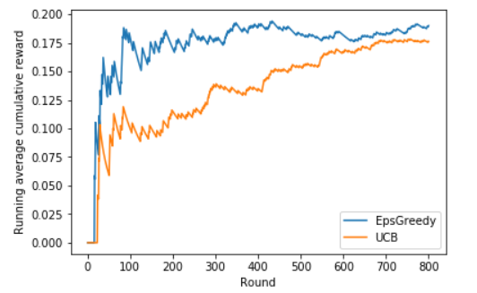

# Multi-Armed Bandits for News Recommendation

[](https://www.python.org/downloads/)
[](https://opensource.org/licenses/MIT)

Implementation of classic multi-armed bandit algorithms for optimizing click-through rates (CTR) in content recommendation systems. Explores the fundamental **exploration-exploitation tradeoff** that appears throughout reinforcement learning and decision-making under uncertainty.

## Problem Statement

News recommendation presents a classic multi-armed bandit problem:
- **10 articles** (arms) with unknown click probabilities
- **Goal:** Maximize total user engagement (clicks) over time
- **Challenge:** Balance exploring new articles vs. exploiting known popular ones

This tradeoff appears everywhere in ML: from clinical AI deciding when to defer to humans, to RLHF systems sampling diverse responses during language model training.

## Algorithms Implemented

### Epsilon-Greedy (ε = 0.01)
- **Strategy:** With probability ε, explore a random arm; otherwise exploit the best-known arm
- **Advantage:** Simple, interpretable, effective baseline
- **Use case:** When computational simplicity matters

### Upper Confidence Bound (UCB, c = 1.0)
- **Strategy:** Select arm with highest upper confidence bound: `Q(a) + c√(log(t)/n(a))`
- **Advantage:** Principled exploration based on uncertainty; theoretically optimal regret: O(√(KT log T))
- **Use case:** When you need provable performance guarantees

## Results

Evaluated on **800 rounds** of real news recommendation data (10,000 total article impressions):

| Algorithm | Average Reward | Improvement vs Random |
|-----------|----------------|----------------------|
| **Epsilon-Greedy** (ε=0.01) | **0.190** | +90% |
| **UCB** (c=1.0) | 0.176 | +76% |
| Random Baseline | ~0.10 | — |

### Performance Over Time



*Running average cumulative reward showing convergence behavior*

**Key findings:**
- Epsilon-greedy converges faster initially due to aggressive exploitation
- UCB shows more stable long-term performance with principled exploration
- Both significantly outperform random selection within 200 rounds

## Implementation Details

**Clean, production-ready code:**
- Object-oriented design with extensible base class architecture
- Offline policy evaluation using logged bandit feedback
- Robust input validation and error handling
- Reproducible experiments with documented hyperparameters

**Key components:**
```python
class BaseMAB(ABC):
    """Base class for multi-armed bandits with common interface"""
    @abstractmethod
    def play(self): pass
    
    @abstractmethod  
    def update(self, arm, reward): pass

class EpsGreedy(BaseMAB):
    """Epsilon-greedy with optimistic initialization"""
    
class UCB(BaseMAB):
    """Upper Confidence Bound with logarithmic exploration bonus"""
```

## Usage
```bash
# Clone repository
git clone https://github.com/serasr/Multi-Armed-Bandits-for-News-Recommendation.git
cd Multi-Armed-Bandits-for-News-Recommendation

# Install dependencies
pip install -r requirements.txt

# Run experiments
jupyter notebook MAB.ipynb
```

**Quick example:**
```python
from mab import EpsGreedy, offlineEvaluate

# Initialize epsilon-greedy bandit
mab = EpsGreedy(n_arms=10, epsilon=0.01, Q0=10)

# Evaluate on historical data
results = offlineEvaluate(mab, arms, rewards, n_rounds=800)
print(f'Average CTR: {np.mean(results):.3f}')
```

## Research Connections

This work explores decision-making under uncertainty—a theme that appears throughout my research:

**Clinical AI Safety:** When should diagnostic systems defer to human experts? 

**LLM Training:** How do we balance exploration (diverse responses) vs exploitation (high-reward responses) during RLHF?

**Active Learning:** Which examples should we label next to maximize model improvement?

The question *"How do we make good decisions when uncertain?"* connects multi-armed bandits, uncertainty quantification, and AI safety.

## Technical Background

**Theoretical foundations:**
- Auer, P., Cesa-Bianchi, N., & Fischer, P. (2002). Finite-time analysis of the multiarmed bandit problem. *Machine Learning*, 47(2-3), 235-256.
- Sutton, R. S., & Barto, A. G. (2018). *Reinforcement Learning: An Introduction*. MIT Press.

**Applications:**
- Content recommendation (news, videos, ads)
- Clinical trial design
- Resource allocation
- Hyperparameter optimization

## Future Directions

- [ ] **Thompson Sampling:** Bayesian approach with Beta-Bernoulli posteriors for natural uncertainty quantification
- [ ] **Contextual Bandits (LinUCB):** Leverage the 10-dimensional feature vectors present in the dataset
- [ ] **Regret Analysis:** Empirical regret bounds and comparison with theoretical limits
- [ ] **Connection to Modern RL:** Bridge to policy gradient methods and RLHF

## Project Context

This implementation was developed as part of advanced statistical ML coursework at the University of Melbourne, exploring foundational reinforcement learning concepts that underpin modern AI systems.

## Author

Sera Singha Roy

For questions about this implementation or my broader research on AI safety and uncertainty quantification, feel free to reach out (LinkedIn link on profile page).

## License

MIT License - see LICENSE file for details.
